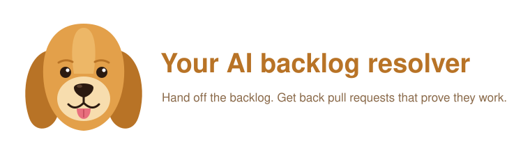

<p align="center">
  
</p>

# Your AI backlog resolver

**Stop steering coding agents. Start managing them.**

Working with a coding agent today means sitting with it: one session, one prompt at a time, watching and
correcting. You can only steer one agent at once, so you're the bottleneck.

This project lets you manage agents instead. Hand off work the way you would to a team: write a clear issue
and label it. Agents pick it up, each on its own disposable cloud computer, and come back with finished pull
requests that are tested and show that the change works. You review results, not sessions.

## Why it's useful

- **Your backlog becomes work in progress.** The small fixes, docs gaps and missing tests nobody gets to are
  each one label away from a pull request.
- **Parallel by default.** Ten labelled issues means ten agents working at once, each in its own sandbox.
- **Proof, not promises.** A PR only appears once its tests pass, and web changes come with a recording of
  the passing run, so reviewing is quick.
- **Anyone can delegate.** If you can write a clear issue, you can hand off a change; an engineer reviews it.
- **You stay in control.** Agents never merge, never see your GitHub token and can't change CI config.
  Every change arrives as a PR you approve.
- **Your repos, your accounts.** No app to install or service to grant access. The orchestrator runs anywhere
  with your GitHub token and your Claude subscription.

> Agents follow the instructions in issue text. Use it on repos where you trust who can file and label issues.

## Setup

```bash
make setup                      # creates .venv (needs uv); `make` lists all commands
modal setup                     # or export MODAL_TOKEN_ID / MODAL_TOKEN_SECRET
```

Put these in a `.env` file in this folder (gitignored), one `KEY=value` per line, or export them in your
shell (the shell wins). Full-line `#` comments are fine; inline comments are not.

```
GH_DEMO_TOKEN=github_pat_...
```

| Variable | What |
|---|---|
| `GH_DEMO_TOKEN` | Fine-grained GitHub token. Agents watch every repo this token can push to, so its repository access *is* their scope. Permissions: Contents, Issues, Pull requests (read/write); leave Workflows off |
| `CLAUDE_CODE_OAUTH_TOKEN` | From `claude setup-token`; runs on your Claude Pro/Max subscription. Or set `ANTHROPIC_API_KEY` instead. If neither is set, `run.py` runs `claude setup-token` for you and caches the token in `.env` (gitignored) until it expires |
| `AGENT_MODEL` | Optional, defaults to `sonnet` |

## Using it

```bash
make watch                      # every repo the token can push to
make issue ISSUE=owner/name#3   # one issue, e.g. to retry a failed one
```

Then label any issue `agent` (create the label in the repo the first time), and review the PR when it
arrives. A failed issue isn't retried while `--watch` keeps running; restart it, or use `make issue`.

Give agents per-repo guidance (how to run the tests, code style) in a `CLAUDE.md` at the target repo's root,
which Claude Code reads automatically.

## Workflow


1. **Start up.** `python agent/run.py --watch`. If no Claude credential is set and `.env` has no valid
   subscription token, it runs `claude setup-token` (you log in in the browser) and saves the token to `.env`.
2. **Watch.** Every minute it asks GitHub which repos the token can push to (skipping archived repos and
   repos with no open issues). Every 5 seconds it checks those repos for open issues labelled `agent`.
3. **Pick up.** For each new labelled issue: relabel it `agent-working`, comment "Picked up", and clone the
   issue's repo with the token. Several issues run at once, each independently.
4. **Sandbox.** Create a Modal sandbox and upload the clone into it. The sandbox gets the Claude credential
   only, never the GitHub token, and can reach only `api.anthropic.com`, the PyPI/npm registries and the
   jsDelivr/unpkg/cdnjs CDNs (so web pages render in browser tests).
5. **Agent.** Claude Code gets the issue text and is told to: make the change; add tests next to the existing
   ones (for a web app, an end-to-end Playwright browser test that records a video and screenshots when
   `DEMO_DIR` is set); and write `/tmp/agent/verify.sh`, a script that runs the whole test suite. It doesn't
   commit. Its steps stream to the orchestrator's terminal.
6. **Verify, in the same sandbox.** The orchestrator runs `verify.sh` itself rather than trusting the agent's
   word. If it fails, the output goes back to the same Claude session ("this failed, fix it"), and the check
   runs again, up to 3 rounds; after that the issue is marked failed with the last output.
7. **Check the change, outside the sandbox.** Pull the diff out, apply it to the orchestrator's clone, and
   refuse to continue if it touches `.github/` (workflows run with the repo's secrets).
8. **Publish.** Commit to branch `agent/issue-N` and push. If the passing run recorded anything, turn the
   video into a GIF (GitHub plays those inline), take only genuine PNG/GIF files under 5 MB, and push them to
   a separate branch `agent-media-issue-N`, so they show in the PR without being part of its changes. Shut
   the sandbox down, open a PR that says "Closes #N" with the agent's summary, the verify result and script,
   and the demo images; comment the link on the issue and relabel it `agent-done`.
9. **On failure** at any step: shut the sandbox down, comment the reason on the issue, relabel it
   `agent-failed`.

## Architecture


There are three parts:

- **The orchestrator** (`agent/run.py`) runs wherever you start it, on your machine or a server.
  It holds the GitHub token, talks to GitHub, and decides what happens next.
- **Modal** gives each issue a fresh, throwaway sandbox from a reusable image with Claude Code installed.
- **Claude** (the model) runs on Anthropic's servers.

**The orchestrator runs the job; Claude Code does the coding inside the sandbox.**

- **Safety:** the agent runs arbitrary commands with permissions skipped, which is fine because the
  sandbox is the boundary. It only holds the model credential; the GitHub token never enters it.
- **Speed:** each issue gets a ready-to-go environment in seconds.
- **Scale:** label three issues and three sandboxes work in parallel.

See [the architecture walkthrough and sequence diagram](docs/architecture.md) for the image build,
per-issue lifecycle, credential boundaries and failure path, or download
[the interactive workflow diagram](docs/laptop-workflow.html) and open it locally to explore each step.

## Repository layout

| Path | What's there |
|---|---|
| `agent/` | The backlog resolver: the orchestrator (`run.py`), the GitHub client (`gh.py`) and the demo issue seeder (`seed_issues.py`) |
| `sample_app/` | A small FastAPI bookshelf app to try it on, with its pytest suite |
| `docs/` | Architecture walkthrough, diagrams and the interactive workflow page |
| `Makefile` | Shortcuts: `make setup`, `make watch`, `make issue`, `make seed` |
| `PRD.md` | Product requirements |

## Running the tests

The sample app's tests cover the endpoints agents change. They also check that the README and
docs link to files that exist and that the commands they show are real. No Modal account is needed:

```bash
pip install -r sample_app/requirements.txt
cd sample_app && python -m pytest -q
```

## Try it on the sample app

`sample_app/` (a small FastAPI app with three seeded bugs) is a ready-made target. Copy it into a repo of its
own, then:

```bash
python agent/seed_issues.py --repo owner/name    # create the three demo issues (add --reset between rehearsals)
python agent/run.py --watch                      # then label issues `agent` in the GitHub UI, live
```

Watch sandboxes appear in the Modal dashboard while the agents run. On a subscription token, parallel agents
share your plan's usage limits.
