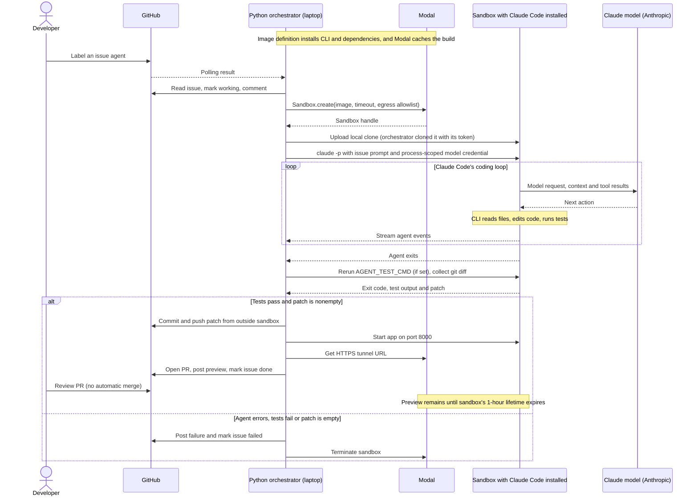

# Architecture: GitHub issue to pull request

**The Python program manages jobs. Claude Code manages the coding loop inside each job's sandbox.**

## Laptop polling and dispatch workflow

The talk demo runs the orchestrator on your laptop with `python agent/run.py --watch`.
You create a GitHub issue and label it `agent`; Python polls every five seconds and dispatches
a fresh Modal sandbox for each newly seen issue. It continues polling while jobs run concurrently.
After Claude Code finishes, Python requests tests and retrieves the patch, then publishes the
branch, PR and preview link from your laptop.

Download [the interactive workflow diagram](laptop-workflow.html) and open it locally,
or use [the slide-ready SVG](laptop-workflow.svg).

## Component architecture

## Build once, reuse per issue

`agent/run.py` defines a Modal image with Python, Git, curl and the Claude Code CLI;
the agent installs the target repo's dependencies itself. Modal builds and caches that image. No credentials
are baked into it. Each issue gets a fresh sandbox created from the image.

The target repository is **cloned per issue** by the orchestrator, with its GitHub token, and
uploaded into the sandbox; it is not baked into this image, and private repos work. The separate
Act 2 snapshot demo illustrates filesystem snapshots, but the issue agent does not
currently boot from a repository snapshot.

## Per-issue sequence

## Responsibilities and credentials

| Component | Runs where | Responsibility | Credentials |
|---|---|---|---|
| Python orchestrator | Your laptop | Claim issue, create sandbox, start agent, request test rerun, extract patch, publish PR and update issue | GitHub and Modal credentials; supplies model credential to agent process |
| Claude Code CLI | Inside the Modal sandbox | Read and edit repository files, run commands, iterate with the model | `CLAUDE_CODE_OAUTH_TOKEN` (subscription), or `ANTHROPIC_API_KEY` |
| Claude model | Anthropic's servers | Reason over context and choose the CLI's next action | Receives authenticated model requests |
| Modal | Modal infrastructure | Build/cache image, provide isolation, execute commands, enforce lifetime and expose preview tunnel | Orchestrator authenticates with Modal token |

The sandbox does not receive the GitHub or Modal token. The model credential is
injected via `modal.Secret` into the Claude Code process; its subprocesses can inherit
it. Process-scoped injection is **not** a guarantee that agent-controlled code cannot
read or persist that credential.

The scaffold allows outbound traffic to `api.anthropic.com` for model calls and to the
PyPI and npm registries for dependency installs; the sandbox never talks to GitHub. Subscription authentication and any additional
required endpoints must be checked during rehearsal. The model is remote; it is
not installed or served inside the sandbox.

## Parallel work, previews and limits

- The local watcher starts concurrent issue jobs, each with its own sandbox.
- Successful sandboxes stay alive for the preview, subject to the 1-hour total lifetime
  measured from creation, not an additional hour after completion.
- Failed jobs attempt to terminate their sandbox immediately.
- A human reviews every PR. The orchestrator does not merge.

## Current verification status

This documents the initial scaffold, not a production-hardened service. The full
Modal/GitHub/subscription flow has not been run end to end.

The test rerun runs the agent's edited tests in its own workspace, so it does not
prove the change meets the issue's requirements. Trusted acceptance tests, restricted
patch paths, bounded concurrency, durable job claims/retries, and stricter credential
handling are follow-ups before using this against untrusted issues or real repositories.
