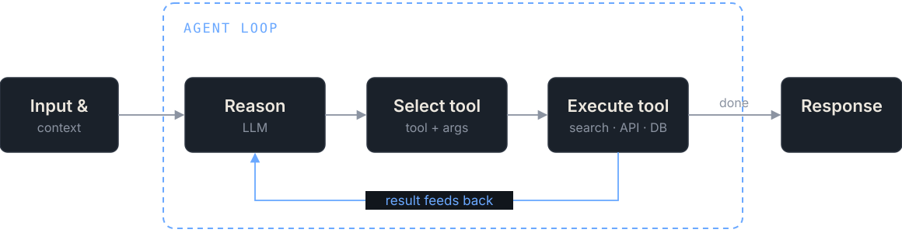
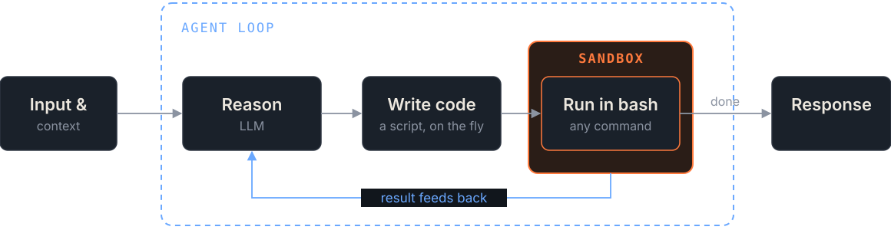
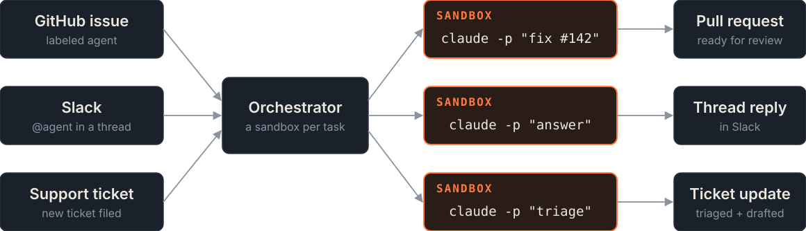

<!-- _class: title -->

[ EvoNexus · Oct 8 ]

# Scale Software Development with AI Sandboxes

From laptop steering to agent swarms

Mathew Mathew · CTO, <a href="https://claramap.com" style="color:inherit">Claramap.com</a>

<svg style="position:absolute;right:90px;top:90px" width="260" height="210" viewBox="0 0 260 210"><rect x="0" y="168" width="34" height="42" rx="4" fill="#ff7a3d"/><rect x="56" y="126" width="34" height="84" rx="4" fill="#ff7a3d"/><rect x="112" y="84" width="34" height="126" rx="4" fill="#ff7a3d"/><rect x="168" y="42" width="34" height="168" rx="4" fill="#6aa8ff"/><rect x="224" y="0" width="34" height="210" rx="4" fill="#6aa8ff"/></svg>

---

Let's connect

<h2 style="margin:0">Mathew Mathew</h2>

CTO &amp; Founder, <a href="https://claramap.com" style="color:inherit">Claramap</a>

Claramap helps companies design, build and run <b>agentic systems</b> in production.

20+ years as a software engineer and data scientist at IBM Cloud, Amdocs, AT&amp;T, SolarWinds and Discover.

SCAN FOR THE SLIDES 
<a href="https://claramap.com">claramap.com</a> 
<a href="https://www.linkedin.com/in/mathewma">linkedin.com/in/mathewma</a> 
<a href="https://github.com/mathaix/fife">github.com/mathaix/fife</a> 
<a href="https://github.com/mathaix/signals">github.com/mathaix/signals</a>

---

Before we start

## Where are you on the ladder?

<b>5</b>Agent swarm<em>Many agents, one problem</em>

<b>4</b>Agent factory<em>Tickets in, PRs out</em>

▲ SANDBOXES · · · · · · · · · · · · · LAPTOP ▼

<b>3</b>Parallel local agents<em>Worktrees and YOLO mode</em>

<b>2</b>Local agent<em>An agent in your terminal</em>

<b>1</b>Autocomplete<em>AI suggests, you do the rest</em>

---

Foundations · 1 of 4

## The agent loop

Every action is a tool you defined. You know exactly what it can do.

---

Foundations · 2 of 4

## The coding agent

Give it bash and it writes its own tools. You can't predict what it will run, so run it in a sandbox.

---

Foundations · 3 of 4

## Headless execution

$ claude -p "Fix the failing test in auth/" --output-format json

<h3>Decompose</h3>

Split a big task. Each subagent gets one job and only the context it needs.

Lead agent
→

claude -p "schema" db/

claude -p "route" api/auth/

claude -p "tests" tests/

<h3>Automate</h3>

No one at the keyboard. Events and schedules start the agent.

CI run

Cron

Webhook

→
claude -p · no human
→
Result

---

Foundations · 4 of 4

## Orchestrate

Same agent, many entry points. Every task gets its own sandbox.

---

Stage 1 of 5 · On your laptop

## Autocomplete

<small>LOOKS LIKE</small>AI suggests. You type, run and check everything.

<small>WHAT BREAKS</small>You want the AI to run the code, not just write it.

<small>BOTTLENECK</small>Your typing

1 Autocomplete

2 Local agent

3 Parallel local

4 Agent factory

5 Agent swarm

---

Stage 2 of 5 · On your laptop

## Local agent

<small>LOOKS LIKE</small>An agent in your terminal runs commands. OS-level sandboxing lets you relax the prompts.

<small>WHAT BREAKS</small>You spend the day clicking Allow.

<small>BOTTLENECK</small>Your approvals

1 Autocomplete

2 Local agent

3 Parallel local

4 Agent factory

5 Agent swarm

---

Stage 3 of 5 · Laptop, straining

## Parallel local agents

<small>LOOKS LIKE</small>Several agents in worktrees and devcontainers, in YOLO mode.

<small>WHAT BREAKS</small>Ports, RAM, credentials and blast radius, all on one machine.

<small>BOTTLENECK</small>Your hardware

1 Autocomplete

2 Local agent

3 Parallel local

4 Agent factory

5 Agent swarm

---

<!-- _class: light -->

The pivot

## What a sandbox is

An ephemeral, isolated computer with an API, where an agent can run anything inside a blast radius you control.

IsolatedEphemeralProgrammableFast to startSnapshottable

---

Isolation

## The isolation spectrum

<b>OS sandbox</b>Seatbelt, bubblewrap, Landlock

<b>Container</b>Namespaces and cgroups; shared host kernel

<b>gVisor</b>User-space kernel intercepts syscalls

<b>microVM</b>Firecracker, Kata; own kernel

<b>Full VM</b>Full hardware virtualization

← FASTER START · LESS OVERHEADSTRONGER BOUNDARY →

---

<!-- _class: sbx -->

Stage 4 of 5 · In sandboxes

## Agent factory

<small>LOOKS LIKE</small>Tickets in, PRs out. One disposable sandbox per task.

<small>WHAT BREAKS</small>One attempt per task isn't enough for hard problems.

<small>BOTTLENECK</small>Review &amp; verification

1 Autocomplete

2 Local agent

3 Parallel local

4 Agent factory

5 Agent swarm

---

<!-- _class: sbx -->

Demo · Stage 4 in practice

## Fife: your AI backlog resolver

1. Label a GitHub issue `agent`
2. A fresh Modal sandbox per issue; Claude Code does the work
3. It writes tests and fixes until they pass, up to 3 rounds
4. A pull request arrives with the passing run as proof

Stop steering agents. Start managing them.

github.com/mathaix/fife

---

<!-- _class: sbx -->

Stage 5 of 5 · In sandboxes

## Agent swarm

<small>LOOKS LIKE</small>Many agents on one problem: fan out, fork, compare.

<small>WHAT BREAKS</small>Cold start and cost per sandbox become architecture decisions.

<small>BOTTLENECK</small>Isolation vs. speed vs. cost

1 Autocomplete

2 Local agent

3 Parallel local

4 Agent factory

5 Agent swarm

---

<!-- _class: light -->

The ecosystem

## Who builds the sandboxes

| Tool | Isolation | Notable |
|---|---|---|
| Firecracker | microVM | Open-source building block from AWS; not a product |
| Docker | Container | Dev default; not enough alone for untrusted code |
| E2B | Firecracker microVM | Agent-focused code-interpreter SDK |
| Modal | gVisor | Built for scale; locked down by default |
| Daytona | Container (Sysbox) | Fast creation; egress allowlists; placeholder secrets |

---

<h1 style="font-size:58px;margin-top:20px">Laptops are where agents learn to code. Sandboxes are where they learn to scale.</h1>

Thank you · Questions?

Mathew Mathew · <a href="mailto:mmathew@claramap.com" style="color:inherit">mmathew@claramap.com</a> · <a href="https://claramap.com" style="color:inherit">claramap.com</a>

